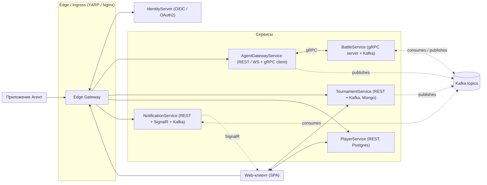
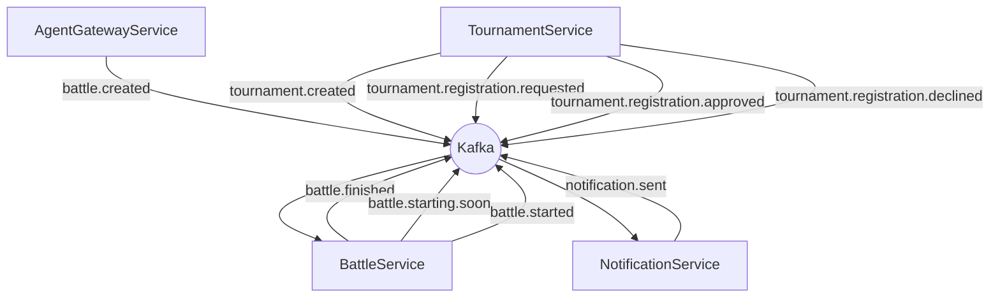
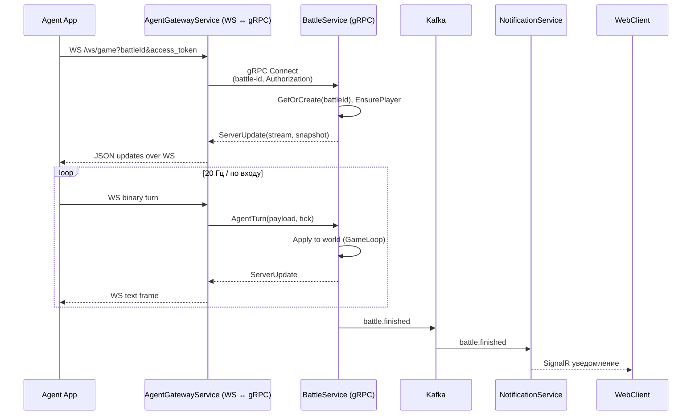

# CosmicBattles Microservices

A microservices-based game backend system built with .NET 9.

## Architecture

The solution consists of the following microservices:

- **PlayerService**: Manages player accounts and profiles
- **TournamentService**: Handles tournament creation and player registration
- **BattleService**: Controls real-time battles via gRPC streams
- **NotificationService**: Delivers real-time notifications via WebSockets

## Prerequisites

- [Docker](https://www.docker.com/products/docker-desktop)
- [Docker Compose](https://docs.docker.com/compose/install/) (included in Docker Desktop)

## Quick Start

To run the entire solution:

```bash
docker-compose up
```

To run in detached mode:

```bash
docker-compose up -d
```

To view logs for a specific service:

```bash
docker-compose logs -f service-name  # e.g., docker-compose logs -f player-service
```

## Service Endpoints

- PlayerService: http://localhost:5001
- TournamentService: http://localhost:5002
- BattleService: http://localhost:5003
- NotificationService: http://localhost:5004 (WebSocket: ws://localhost:5004/ws/notifications)

## Observability

- Prometheus: http://localhost:9090
- Grafana: http://localhost:3000

## Development

Each service can also be run independently for development:

```bash
# Run just the infrastructure
docker-compose up postgres mongo kafka zookeeper

# Run a specific service
cd src/PlayerService
dotnet run
```

## Stopping Services

To stop all services:

```bash
docker-compose down
```

To stop and remove all data volumes:

```bash
docker-compose down -v
```

Архитектура
---



События в Kafka
---


Последовательность взаимодействия
---



Микросервисы и приложения
**IdentityServer**
- OIDC/OAuth2, issuer: /auth (внешний через YARP).
- JWT для всех сервисов, SignalR-авторизация в NotificationService, gRPC — в BattleService/AgentGateway.
 


**AgentGatewayService**
- Назначение: WebSocket ↔ gRPC мост, SignalR-хаб для агентов, публикатор событий.
- Эндпоинты:
- - GET /healthz, GET /
- - POST /api/matchmaking/casual — публикует battle.created (сейчас без RequireAuthorization — рекомендуется включить)
- - POST /api/battles/{battleId}/connect?playerId= — регистрация агента (через менеджер)
- - WS /ws/game?battleId&access_token — игровой поток (RequireAuthorization)
- -SignalR /hubs/agent

*BattleService*
- Назначение: игровой мир, gRPC поток, хранение in-memory, таймер завершения, Kafka consumer/producer.
- Эндпоинты:
- - gRPC BattleSynchronizer.Connect (bidirectional, [Authorize])
- - GET / (health), метрики /metrics (через OpenTelemetry/Prometheus)
- События:
- - consume: battle.created
- - produce: battle.finished, battle.started, battle.starting.soon (рекомендация)

NotificationService
- Назначение: хранение/раздача уведомлений, SignalR-пуш, Kafka consumer.
- Эндпоинты:
- - SignalR /ws/notifications (JWT из query, Policy "notif-scope")
- - GET /api/notifications/unread/{userId:guid}
- - POST /api/notifications
- - GET / (health), /metrics
- События:
- - consume: battle.finished, tournament.* (invites, approvals, reminders), battle.starting.soon

*TournamentService*
- Назначение: создание турниров, регистрация, список, детали; Mongo.
- Эндпоинты:
- - POST /tournaments (рекомендуется RequireAuthorization)
- - POST /tournaments/{id}/register (RequireAuthorization)
- - GET /tournaments/upcoming
- - GET /tournaments/{id}
- События:
- - produce: tournament.created, tournament.registration.requested, tournament.registration.approved/declined
- - produce: battle.created (на стадии сетки или «быстрый матч») — опционально переложить матчмейкинг сюда

*PlayerService*
- Назначение: профили игроков, рейтинг (можно расширить), Postgres.
- Эндпоинты:
- - POST /players
- - GET /players/{id:guid}
- - GET /players/me (RequireAuthorization)

*Веб-приложения&
- SPA (портал): аутентификация через IdentityServer; разделы турниров, профиль, просмотр уведомлений, реигры.
- Агент: десктоп/CLI, получает access_token, подключается к AgentGateway WS, потоковые команды.

*Сообщения (JSON-схемы, кратко)*
- battle.created
- - { battleId, tournamentId?, participants: Guid[] }
- battle.started / battle.starting.soon / battle.finished
- - { battleId, startedAt/startsAt/finishedAt, winnerId?, participants }
- tournament.created
- - { tournamentId, name, startsAt, status }
- tournament.registration.requested/approved/declined
- - { tournamentId, applicantId, decision? }
- notification.enqueue (если понадобится общий топик)
- - { recipientId, kind, payload }

*Узкие места и масштабирование*
**BattleService**
- CPU-bound 20 Гц миры; текущее хранение InMemory — горизонтальное масштабирование по ключу battleId.

Решения:
- Консистентный хеш (by battle-id) на уровне ingress/service mesh (Istio/Envoy) или client-side LB в AgentGateway, чтобы поток gRPC попадал на «свою» реплику.
- Ограничить размер мира: 1 battle = 1 мир; кластер из N инстансов, статический/динамический шардирующий маппинг.
- Перевод snapshot/updates в компактный двоичный формат (сейчас JSON в WS) для экономии сети.
- Переезд из in-memory на Redis только для метаданных/лейблов; игровая логика — локальна реплике (иначе дорого).

**AgentGatewayService**
- Много WS-соединений + gRPC клиентов. Включено EnableMultipleHttp2Connections — хорошо.

Решения:
- Горизонтальное масштабирование; sticky-session по playerId/battleId не требуется, если Connect->BattleService направляется консистентно.
- Backpressure и лимиты размера кадров WS.
- NotificationService
- SignalR scale-out: Redis backplane или Azure SignalR для множества узлов.
- Kafka consumer — партиционировать по recipientId для равномерности.
- IdentityServer
- Кэш JWKS, профилирование БД. Для высокой нагрузки — отдельный кластер, CDN для статики, короткий TTL introspection cache.
- Kafka
- Размеры топиков и партиции: battle.* партиционировать по battleId, tournament.* — по tournamentId, notification.* — по recipientId.
•	БД
•	TournamentService (Mongo) — индексы по startsAt/status.
•	PlayerService (Postgres) — индексы по внешним ключам, оптимизация upsert рейтингов.
•	NotificationService (Postgres) — индексы по recipientId, unread.

Компоненты с частыми изменениями и OCP
*Игровые правила/физика/оружие*
- Уже выделено: IGameSystem, команды, стратегии снарядов. Применять Strategy/Composite/Chain of Responsibility для пайплайна обработки событий.
- Расширение: регистрировать IGameSystem через DI (модули), конфигурируемый порядок.

*Матчмейкинг*
- Стратегии подбора (Elo, случайный, турнирная сетка) — Strategy; вынести из AgentGateway в отдельный MatchmakingService.
- Рейтинги игроков и турниров
- Инкапсулировать в RatingService с интерфейсами IRatingCalculator для разных формул; хранение с версионированием формул.

*Уведомления*
- Каналы (SignalR, email, push) — Strategy; шаблоны сообщений — Provider на основе культуры/типа события; outbox для гарантированной доставки.

*Турнирные правила*
- Валидация заявок/допуск — Chain of Responsibility; хранение правил в конфигурации/скриптах.

*Запись и просмотр боёв (Replay)*
- Ввести ReplayService: события/снимки мира пишутся в Kafka/хранилище; воспроизведение — HTTP/stream.
